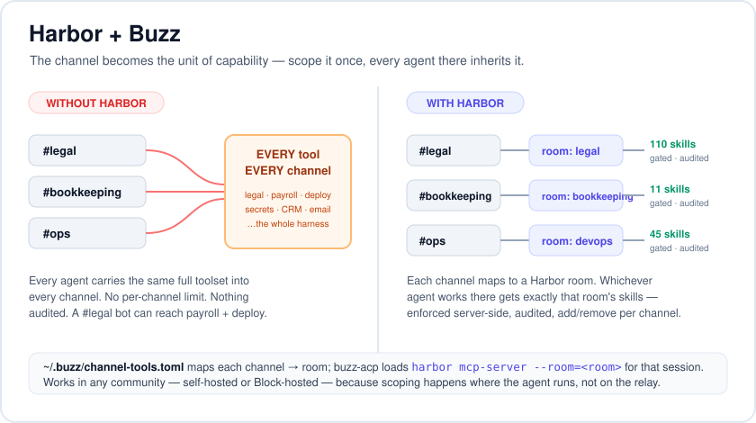

# Harbor

> *Tugboat pulls you into Harbor.*

> **⚠️ Alpha (`0.1.1`) — unproven, expect breakage.** Feature-complete and green in CI, but
> not yet validated in real-world use. Expect bugs and breaking changes between versions —
> don't build on it yet. Found something off? [Open an issue](../../issues).

**An agent control plane** — scheduler, compaction, isolation, and session tracking for AI
coding agents, with a universal MCP integration so any MCP-capable agent (Claude Code, Cursor,
OpenCode, Codex, Gemini CLI, Goose) routes its skill access through one gate.

The npm package and import name is **`harbor-tugboat`**; the command it installs is **`harbor`**.

Harbor gives you:

- **Dynamic sequential skill execution** — agents discover skills via keyword search (`search_skills`)
  and activate exactly one skill at a time (`activate_skill`), keeping context lean (<150 tokens for lookup)
  and preventing tool/prompt bloat.
- **Room-gated skill access** — each agent session runs in a *room*; skills and MCP servers
  are scoped to rooms, and access outside the room is denied and audited.
- **In-process budget enforcement** — token budgets are checked and debited with a direct
  function call (`<1ms`), not a subprocess bridge.
- **Context compaction** — LRU eviction with an archive, so a long-running session stays
  inside its token budget.
- **A priority-queue scheduler** — SQLite-backed, budget-aware task dispatch.
- **Session tracking + a live dashboard** — file-based session state with a SQLite rollup,
  served on a local HTTP dashboard with WebSocket updates.
- **Channel-scoped tools for [Buzz](https://github.com/block/buzz)** — map a Buzz channel to
  a room so every agent working there is confined to exactly that room's skills and MCP tools,
  enforced and audited; a companion desktop panel manages it. See [docs/BUZZ.md](./docs/BUZZ.md).

**Running Harbor-managed automations on Pi (the coding agent) — context scoping.**

Recurring / scheduled agent workflows (Harbor's own scheduler, or an external scheduler
such as n8n/launchd invoking a recipe runner) should load **only the skills each task needs**
— not the whole agent pool — and keep the model prompt lean. That is the same dynamic
on-demand model as interactive sessions (`activate_skill` one skill at a time), applied to
headless runs.

Known integration notes from `TDH-Labs/Harbor` on Pi (as of 2026-08):

- Pi injects the *entire* auto-discovered skill pool (`~/.agents/skills`, often 400+) into its
  system prompt at startup. Against a slow local model this balloons the prompt to ~46k tokens
  and stalls/hangs generation. Scope it: `-ns/--no-skills` (drop the auto list) plus
  `--skill <dir>` (load only the skills a task actually needs) — verified to drop a ~46k prompt
  to ~2-3k tokens and restore fast, stable generation.
- The Harbor pi-extension (`integrations/pi.ts` -> the pi `skill-accessor.ts` shim) currently
  does **not** load reliably inside Pi: it crashes under Node (`Bun is not defined` because the
  `harbor-tugboat` barrel re-exports Bun-only modules) and hangs under Bun during skill
  registration. Until that extension-load path is hardened, headless automation runs should
  not rely on the extension loading — use the scoped `-ns --skill` pattern instead, and treat
  wiring Harbor's own `spawn()`/`scheduler` as the automation host as the follow-up so auto
  workflows get Harbor room/budget/session ownership *and* on-demand skills.
- Standardize the local model port (e.g. `8270`) for MTPLX/Ollama OpenAI-compatible servers to
  avoid a stray process squatting on a common port like `8000` wedging the scheduler.
  Reflected in the `com.mtplx.server` launchd plist, pi's `models.json`, and the recipe runner.

---

## Install

Alpha is **not on npm yet** — install from the release tarball or straight from the repo.
The npm commands light up at beta.

```bash
# Alpha (now) — from the release tarball
npm i -g ./harbor-tugboat-0.1.1.tgz

# …or straight from the repo
bun add github:TDH-Labs/Harbor

# Beta (once published to npm)
npm install -g harbor-tugboat   # installs the `harbor` command
npx harbor-tugboat --help       # or run without installing
```

You install **`harbor-tugboat`** but run **`harbor`**. It needs **Bun ≥ 1.1** — the binary is a
Bun program. A standalone, dependency-free binary is also available (see
[Single binary](#single-binary)).

---

## Quickstart

From a clean machine, three commands stand up a working environment:

```bash
harbor init     # seed agent_map.md + generate the AI beacons (AGENTS.md, CLAUDE.md, .cursorrules)
harbor setup    # build the directory tree from config, generate beacons
harbor check    # read-only health check — reports what's wired and what's missing
```

By default the environment root is your home directory and state lives under
`~/.agent-env/`. To stand one up somewhere else (e.g. a scratch dir), pass `--root`:

```bash
harbor init  --root /tmp/my-env
harbor setup --root /tmp/my-env
harbor check --root /tmp/my-env
```

`setup` creates the standard tree (idempotent — safe to re-run):

```
<root>/
  agent_map.md          # routing table: rooms + projects
  AGENTS.md             # generated beacon (stamped <!-- agent-env:sync -->)
  CLAUDE.md             # generated beacon
  .cursorrules          # generated beacon
  workspace/            # active project working dirs
  rooms/                # per-room rules + skill indexes
  data/                 # structured/queryable data
  archive/              # evicted-context archive
  .agents/skills/       # the skill pool
  .agent-env/           # state: SQLite DBs, logs, sessions, watcher pidfile
```

Everything is configurable via `config.toml` (default location `~/.agent-env/config.toml`,
or pass `--config <path>`). A machine with no `config.toml` runs entirely on the built-in
defaults — no edits required.

---

## Wire up an agent

`harbor install --for <agent>` **emits** the exact config block to add for an agent and
changes nothing on disk. Review it, then either paste it yourself or re-run with `--write`
(which backs up the existing file first). Harbor never silently mutates a running agent's
config.

```bash
# See the MCP server entry for Claude Code (prints to stdout, writes nothing)
harbor install --for claude-code

# Apply it (backs up the existing config first)
harbor install --for claude-code --write
```

Supported agents:

| Agent       | Integration                | `--for` value  |
|-------------|----------------------------|----------------|
| Claude Code | MCP server (stdio)         | `claude-code`  |
| Cursor      | MCP server (stdio)         | `cursor`       |
| OpenCode    | MCP server (stdio)         | `opencode`     |
| Codex CLI   | MCP server (stdio)         | `codex`        |
| Gemini CLI  | MCP server (stdio)         | `gemini`       |
| Goose       | MCP server (stdio ext)     | `goose`        |
| Antigravity | MCP server (stdio)         | `antigravity`  |
| Pi          | In-process import (Tier 2) | `pi`           |
| Orchestrator| MCP server, one per room   | `orchestrator` |

Antigravity is Google's agentic IDE and a **different product from the Gemini CLI**, with
its own config file (`~/.gemini/config/mcp_config.json` vs the CLI's
`~/.gemini/settings.json`) — same directory, different file. Installing one does not
configure the other.

Once installed, the agent reaches Harbor's gated tools (`search_skills`, `activate_skill`,
`deactivate_skill`, `read_skill`, `list_skills`, `list_rooms`, budget/audit queries) over a single
persistent MCP connection. The room and session come from the `AGENT_ENV_ROOM` and `AGENT_ENV_SESSION`
environment variables — but **how each client gets them there is client-specific and not interchangeable.** Every dialect below was
verified against the real client, because a client handed a syntax it does not recognize
does not error: it passes the template text through as the room name.

| Client | Substitution | Emitted form |
|--------|--------------|--------------|
| Claude Code, Gemini CLI | `${VAR}`, with `${VAR:-default}` | `${AGENT_ENV_ROOM:-<room>}` |
| Cursor | VS Code `${env:VAR}`; parent env filtered | `${env:AGENT_ENV_ROOM}` |
| OpenCode | its own `{env:VAR}`; `${VAR}` ignored | `{env:AGENT_ENV_ROOM}` |
| Codex | none; child env is scrubbed | `env_vars` passthrough |
| Goose, Antigravity | none at all | literal room, pinned at install |

`harbor install --for <agent>` emits the right dialect automatically — pass `--room` to pick
the room baked in as the default. Clients that interpolate still let `AGENT_ENV_ROOM` from
the launching environment win.

For a client that cannot substitute, scope a single session by launching it with its own
per-invocation override rather than editing the static config — e.g. for Goose:

```bash
goose session --with-extension "AGENT_ENV_ROOM=<room> AGENT_ENV_SESSION=<id> harbor mcp-server"
```

For Pi (and any TypeScript/JavaScript agent with import-level extensions), use the in-process
path instead — a direct function call, no subprocess:

```ts
import { registerHarborSkills } from "harbor-tugboat/integrations/pi";

export default function (pi: any) {
  registerHarborSkills(pi, {
    procEnv: {
      AGENT_ENV_ROOM: process.env.AGENT_ENV_ROOM || "devops",
      AGENT_ENV_SESSION: process.env.AGENT_ENV_SESSION || `pi-${Date.now()}`,
    },
  });
}
```

---

## Dynamic Sequential Skill Execution

Traditional skill systems dump every markdown skill into the agent's system prompt simultaneously. With 20–50 skills, this consumes **20,000–80,000+ tokens on every single turn**, causing model confusion, instruction drift, and high latency.

Harbor replaces static loading with **Dynamic Sequential Execution**:

1. **Search (`search_skills`)**: Agent searches available room skills by query. Harbor returns lean metadata summaries (<150 tokens) instead of full file content.
2. **Activate (`activate_skill`)**: Agent activates exactly **one** skill. Harbor verifies room access, debits the token budget, sets active session state, and injects the skill instructions.
3. **Execute**: The agent performs its task with focused, distraction-free context.
4. **Deactivate (`deactivate_skill`)**: When finished, the agent clears active skill state before activating the next skill.

| Tool | Purpose | Context Cost |
|---|---|---|
| `search_skills` | Find relevant skills by query (room-scoped) | ~50–150 tokens |
| `activate_skill` | Load instructions for the active skill | ~500–2,000 tokens (1 skill only) |
| `deactivate_skill`| Clear active skill from state | 0 tokens |
| `read_skill` | Direct on-demand read (room-gated, budgeted) | Size of skill |
| `list_skills` | List all skill names & descriptions in the room | ~100–300 tokens |

---

## Buzz

Harbor turns a [Buzz](https://github.com/block/buzz) **channel** into the unit of capability:
map a channel to a room and every agent that works there is confined to exactly that room's
skills — enforced server-side, audited, and the same in any community (self-hosted or
Block-hosted).

<p align="center">
  
</p>

```bash
harbor channel-tools legal --map      # scope a channel to a room (on the fly)
harbor channel-tools legal --json     # what a channel exposes (the shape a GUI reads)
harbor channel-persona legal --json   # the persona a channel runs under (auto-derived from its room)
```

**[→ Full guide: docs/BUZZ.md](./docs/BUZZ.md)** — the policy file, both integration modes
(per-agent on stock Buzz, or per-channel with the companion patch), and making agents reliably
use skills.

---

## Security model

Harbor is a control plane, not a sandbox. It governs how cooperating agents load skills,
spend budget, and enter rooms — and records every decision. It is not a cage for a hostile
process.

**What Harbor enforces**

- **Gated skill access** — every skill load runs a room + budget + audit check.
- **In-process budgets** — token limits debit on the hot path; no quiet overspend.
- **Full audit trail** — every allow and deny is logged with room, session, and reason.

**Where the boundary ends**

- **Not an OS sandbox.** Harbor doesn't intercept syscalls or lock the filesystem. An agent
  with raw file access can read a skill file directly and skip the gate.
- **Rooms are cooperative.** A session's room comes from `AGENT_ENV_ROOM`, set by whatever
  launches the agent. Harbor trusts it — a process that can rewrite its own environment can
  change its room.
- **Open by default, for CONFIGURED rooms.** A configured room with an empty `skills` list
  allows every skill. Gating is opt-in: list skills to restrict a room, leave it empty to
  allow all — so a fresh install is usable, not locked shut.
- **Unknown rooms fail closed.** A room that is not in config at all is an error state, not
  a wildcard: it is denied everything. Only the configured default room is exempt, since a
  fresh install legitimately runs there before any room section exists. This matters because
  a blank or unsubstituted `AGENT_ENV_ROOM` used to land in that gap and read the entire
  pool across every room; blank and still-a-placeholder values now normalize to the default
  room instead of becoming one.

Harbor makes the cooperative path the easy, observable, budgeted one. It doesn't claim to be
unbypassable OS-level isolation — that's a separate layer, on the roadmap, not in `0.1`.

---

## CLI reference

Run `harbor <command> --help` for full flags. All commands accept the global selectors
`--config <path>` (load a `config.toml`, whose `paths.home` sets the root) and `--root <dir>`
(use built-in defaults rooted at `<dir>`).

**Environment**

| Command | What it does |
|---------|--------------|
| `harbor init` | Seed `agent_map.md` and generate the home beacons. |
| `harbor setup` | Build the directory tree from config; generate beacons. |
| `harbor check` | Read-only health check of the environment. |
| `harbor sync [--generate-only]` | Regenerate beacons (and discover projects unless `--generate-only`). |
| `harbor watch` / `start` / `stop` | Run / daemonize / stop the beacon file watcher. |
| `harbor dashboard [--port N]` | Serve the health dashboard (default port 8765). |

**Agent OS core**

| Command | What it does |
|---------|--------------|
| `harbor scheduler <submit\|list\|stats\|cancel\|run-once\|daemon>` | Priority-queue task scheduler. |
| `harbor compaction <stats\|archive\|retrieve\|list-archive>` | Context compaction + archive. |
| `harbor isolation <check\|rooms\|audit\|denials>` | Capability / room gating + audit. |
| `harbor session <start\|track\|end\|list\|active>` | Agent session tracking. |

**Hypervisor primitives**

| Command | What it does |
|---------|--------------|
| `harbor spawn -- <cmd>` | Spawn a Harbor-owned child (room, budget, timeout). |
| `harbor budget <check\|spend>` | In-process token budget check / debit. |
| `harbor gate <room> <tool> [resource]` | Room-gated capability check. |
| `harbor audit <recent\|denials>` | Hypervisor audit trail. |

**Skills + MCP**

| Command | What it does |
|---------|--------------|
| `harbor skills-list [--room R] [--json]` | List pool skills with room assignments. |
| `harbor skill-create` / `skill-install` / `skill-assign` | Scaffold / install / route skills. |
| `harbor skill-room-add` / `skill-update` / `skill-remove` | Grant a skill to another room / overwrite it / unregister it. |
| `harbor mcp-add` / `mcp-remove` | Add or remove an MCP server for a room. |
| `harbor mcp-check` / `mcp-gen` / `mcp-merge` | Validate / generate / merge per-room MCP configs. |
| `harbor secrets` | Keychain-backed secrets — keep credentials out of config files. |
| `harbor approval` | Human-in-the-loop grants for a cross-room skill load. |

**Buzz** (see [docs/BUZZ.md](./docs/BUZZ.md))

| Command | What it does |
|---------|--------------|
| `harbor channel-tools <channel> [--json]` | Show the skills + MCP servers a Buzz channel exposes. |
| `harbor channel-tools <channel> --map [--room R]` | Scope a channel to a room on the fly (creates the room + records the mapping). |
| `harbor buzz-pack` | Emit a Buzz Persona Pack from Harbor rooms (one room → one persona). |
| `harbor channel-persona <channel> [--json]` | Show or manage the persona a Buzz channel runs under — auto-derived from its room, or overridden (`--set-file` / `--set-inline` / `--sync` / `--remove`). |
| `harbor room-personas <room> [--json]` | List the personas a room offers (`rooms/<room>/agents/*.md`). |
| `harbor room-persona <room> <name> [--json] [--set-body T]` | Read or edit a single room persona's full text (the canonical persona). |

**Integrations**

| Command | What it does |
|---------|--------------|
| `harbor mcp-server [--room R]` | Run the Harbor MCP server over stdio (Tier 1, universal). |
| `harbor install --for <agent> [--write]` | Emit (or apply) an agent's integration config. |

---

## Programmatic use

```ts
import { createSession, checkBudget, spendBudget, audit } from "harbor-tugboat";

const session = createSession({ room: "research", budget: 150_000 });

const allowed = checkBudget(session.id, "some-skill", 5072);
if (allowed.ok) {
  // load the skill, then debit:
  spendBudget(session.id, "some-skill", 5072);
}
```

Subpath exports mirror the modules — `harbor-tugboat/scheduler`, `harbor-tugboat/compaction`,
`harbor-tugboat/isolation`, `harbor-tugboat/budget`, `harbor-tugboat/gate`,
`harbor-tugboat/audit`, `harbor-tugboat/evict`, and more.

---

## Single binary

Harbor compiles to a standalone executable with no Bun or Node.js required on the target:

```bash
bun build --compile --target=bun-darwin-arm64 ./src/cli.ts --outfile harbor-darwin-arm64
bun build --compile --target=bun-linux-x64    ./src/cli.ts --outfile harbor-linux-x64
```

SQLite is bundled (Bun ships it built-in), so the binary is self-contained.

---

## Configuration

Harbor reads `config.toml` (default `~/.agent-env/config.toml`) merged over built-in
defaults. Rooms, room capabilities, per-room MCP servers, token budgets, watch paths, and
skill-pool sources are all config-driven. The shipped defaults are generic — example MCP
servers are `filesystem` and `github`; no personal servers, paths, or room names are baked
in. See `harbor check` and `harbor isolation rooms` to inspect the resolved configuration.

---

## License

[MIT](./LICENSE)
