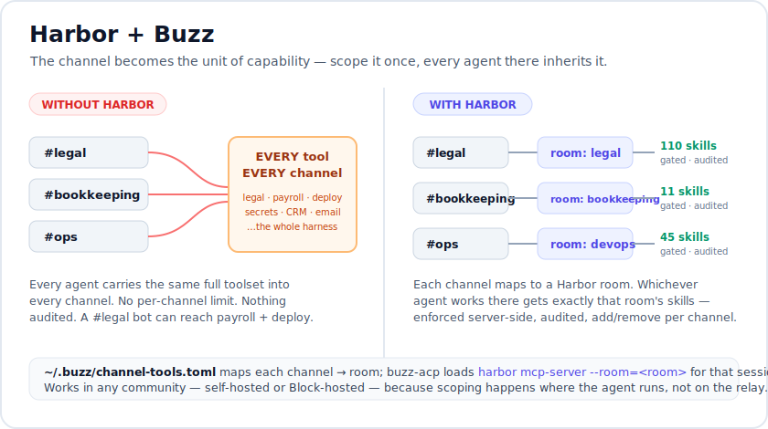

# Harbor + Buzz

**Give every [Buzz](https://github.com/block/buzz) channel its own curated, gated toolset —
and make whichever agent works there inherit it.**

Buzz is an open, Nostr-based agent workspace: channels are group chats, and you run agents
that respond in them. Out of the box every agent an operator runs carries whatever skills and
extensions its harness happens to be configured with — the same everywhere, ungoverned per
channel. Harbor changes the unit of capability from the *agent* to the *channel*.

<p align="center">
  
</p>

## The idea in one line

A Buzz **channel** maps to a Harbor **room**; the room is the source of truth for the skills
and MCP servers agents may use when they work in that channel. Scope a channel once and *every*
agent that responds there — now or later — is confined to exactly that toolset, enforced
server-side and audited. Nothing leaks in from the harness; nothing leaks across channels.

## How it works

When an agent's session is created for a channel, [buzz-acp](https://github.com/block/buzz)
looks the channel up in `~/.buzz/channel-tools.toml` and **replaces** the session's MCP servers
with the channel's scope:

```
channel has an entry?  →  session gets exactly `harbor mcp-server --room=<room>`
no entry               →  session keeps the harness's own default extensions
```

That one MCP server exposes the room's skills as `list_skills` / `read_skill` tools, gated by
room and token budget. The lookup keys on the **channel** (by name or UUID), not the agent — so
if five agents answer in `#legal`, all five get the `legal` room's skills, and none of them can
load a skill from another room.

Because scoping happens where the agent *runs* (your machine's buzz-acp reading your local
policy), it applies in **any** community the agent works in — self-hosted or Block-hosted. The
relay only moves messages; it has no say over an agent's tools.

## Two ways to wire it up

### 1. Per-agent, on stock Buzz (no fork)

Unmodified Buzz already lets you set any agent's MCP command. Point it at Harbor:

```
mcp_command = harbor mcp-server --room=legal
```

That agent is now Harbor-scoped wherever it goes. Simple, but it's per-agent and manual — the
scope travels with the agent, not the channel.

### 2. Per-channel, channel-native (companion Buzz patch)

The channel-native experience — a channel defines the toolset, a GUI panel to manage it, and
on-the-fly scoping — is a small patch to Buzz that reads the policy file below. See the
companion fork for the desktop panel and the buzz-acp channel-tools reader.

## The policy file

`~/.buzz/channel-tools.toml` (buzz-acp reads it via `--channel-tools` / `BUZZ_ACP_CHANNEL_TOOLS`):

```toml
harbor_command = "harbor"          # binary used for `room` entries (default: harbor on PATH)

[channels.legal]                    # a channel keyed by name (case-insensitive) or UUID
room = "legal"                      # → expands to: harbor mcp-server --room=legal

[channels.bookkeeping]
room = "bookkeeping"

[[channels.ops.mcp]]                # or declare explicit MCP servers inline for a channel
name = "grafana"
command = "grafana-mcp"
```

You rarely edit it by hand — the CLI (and the GUI) write it for you.

## CLI

```bash
# What does a channel expose? (the shape the GUI reads)
harbor channel-tools legal
harbor channel-tools legal --json

# Directory of every mapped channel → room
harbor channel-tools

# Scope a channel on the fly — creates its room + records the mapping (idempotent)
harbor channel-tools welcome-everyone --map
harbor channel-tools welcome-everyone --map --room greeters   # explicit room

# Every skill in the pool (name/room/description) — for a "pick a skill" UI
harbor skills-list --json

# Add tools to a channel's room (any harbor room verb works)
harbor skill-room-add --skill nda-review --room legal   # grant an existing skill
harbor skill-install  --source ./my-skill --room legal  # install a new one, route it here
harbor mcp-add --room legal --name docsign --command docsign-mcp
```

## Making agents actually use the skills

Availability isn't compulsion. The `harbor mcp-server --room` a channel loads sends the agent a
directive at connect time — *"before you start, call `list_skills` and load any skill whose
description matches the task; a matching skill's instructions are authoritative."* — so
invocation is reliable across every agent and channel at one point, with no per-agent prompt
edits. The single biggest lever on hit-rate is a good skill **description**: the model reaches
for a skill when its description fits the task.

## Notes

- **Scopes are keyed by channel name, globally on your machine.** A channel named `legal` in two
  different communities gets the *same* scope. To scope one specific channel differently, key its
  entry by the channel's UUID instead of its name.
- **The scope replaces, it doesn't merge** — inside a scoped channel the agent has exactly the
  room's tools, so the room must contain everything that channel's work needs. Add what's missing
  with the CLI (or the panel) rather than falling back to the agent.
- **The scope lives with the agent runtime.** Run agents on a different host (e.g. a cloud
  worker) and that host needs its own `harbor` + `channel-tools.toml`.
